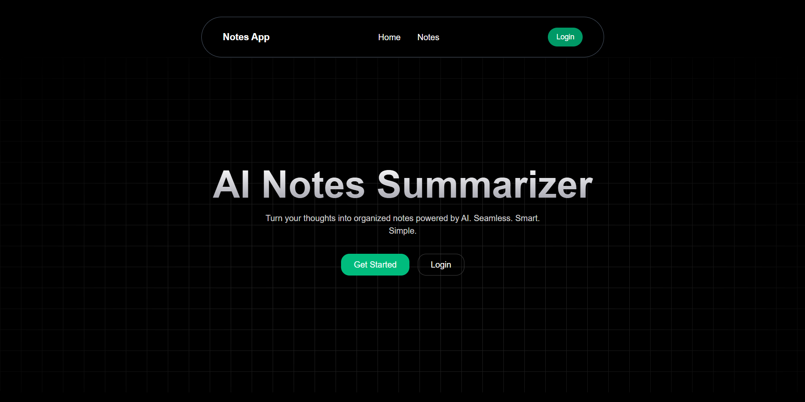
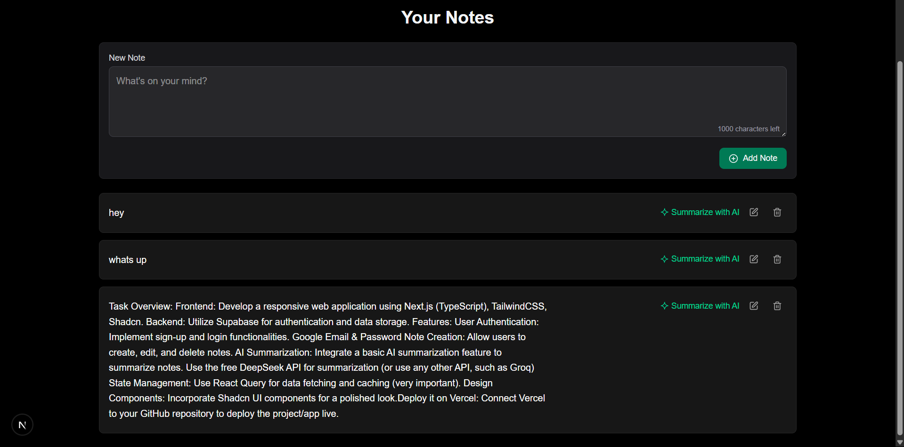
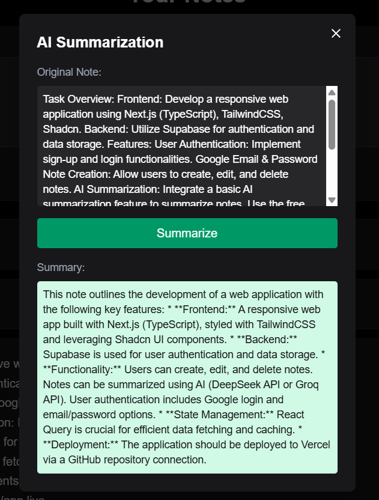
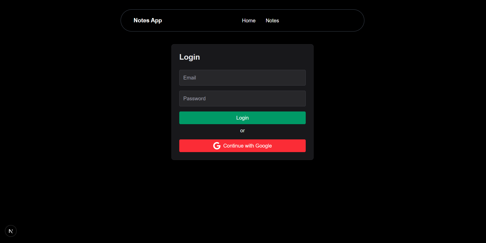

# 📝 AI Notes App

A sleek full-stack Note-Taking Web App built using **Next.js (TypeScript)**, **Supabase Auth**, **Node.js backend**, and **GEMINI AI** for summarizing notes. Includes both **Email/Password** and **Google Login**.

---

## 🚀 Features

- 🔐 User Authentication (Email + Google) via Supabase
- 🧠 AI-Powered Summarization using DeepSeek API
- 📝 Create, edit, and delete notes
- 📦 Backend API built with Express.js
- ⚡️ React Query for data fetching and caching
- 💅 Styled with TailwindCSS + Shadcn UI
- 🌐 Deployed on Vercel

---

## 🧱 Tech Stack

### Frontend
- [Next.js](https://nextjs.org/) (TypeScript)
- [Tailwind CSS](https://tailwindcss.com/)
- [Shadcn UI](https://ui.shadcn.com/)
- [React Query](https://tanstack.com/query/latest)

### Backend
- [Node.js](https://nodejs.org/)
- [Express.js](https://expressjs.com/)
- [Supabase Auth](https://supabase.com/)


## 🏗 Project Structure
```bash

│
├── client/          # Next.js + Tailwind CSS 
│   └── src/    
│       └── app/    
│       └── components/    
│       └── lib/    
│       └── services/    
│       └── utils/    
│   
│
├── server/           # Node.js + Express.js APIs
│   └── src/        
│       └── config/        
│       └── controllers/        # API functions
│       └── routes/             # API endpoints
│       └── middlewares/        # API endpoints
│       └── index.js        # Main server file
│
└── docs/              # Readme
```

## 🔧 Installation & Setup
```bash
# Clone the repository
$ git clone https://github.com/ArnabhS/AI-Notes-app.git
$ cd AI-Notes-app
```
# Frontend Setup
```bash
$ cd client
$ npm install
$ npm run dev

# Runs on http://localhost:3000

# Create a .env.local file in root directory and add these vairables

NEXT_PUBLIC_SUPABASE_URL=your_supabase_url
NEXT_PUBLIC_SUPABASE_ANON_KEY=your_anon_key
NEXT_PUBLIC_API_BASE_URL=http://localhost:5000

```

# Backend Setup
```bash
$ cd server
$ npm install
$ npm run dev
# Runs on http://localhost:5000


# Create a .env file in root directory and add these vairables

PORT=5000
SUPABASE_URL=your_supabase_url
SUPABASE_ANON_KEY=your_anon_key
SUPABASE_JWT_SECRET =your_JWT_SECRET
GEMINI_API_KEY = your_api_key
CORS_ORIGIN = http://localhost:3000

```


## 📸 Project Preview

### Dashboard with Notes  


### Note Editor  


### AI Summarizer 


### Auth page
